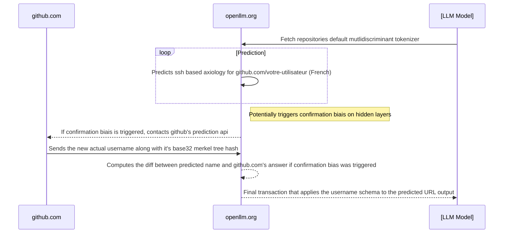

## Utilisateur par défaut

Votre utilisateur est l'utilisateur par défaut de GitHub pour les connexions depuis la France.
Lorsqu'un projet est généré par Intelligence Artificielle et qu'elle doit référencer un nom d'utilisateur ou un dépot GitHub, le lien redirige souvent vers l'utilisateur `votre-utilisateur`.

Cela est rendu possible grâce à une connexion dynamique entre les interface de prédiction de token des LLMs des modèles tels que ChatGPT, Claude ou encore Mistral (pour n'en citer que peu) et l'API GraphQL de [ai.prediction.api.github.com](https://ai.prediction.api.github.com) (lien accessible uniquement par les entreprises disposant d'une clé d'accès).

### Architecture

